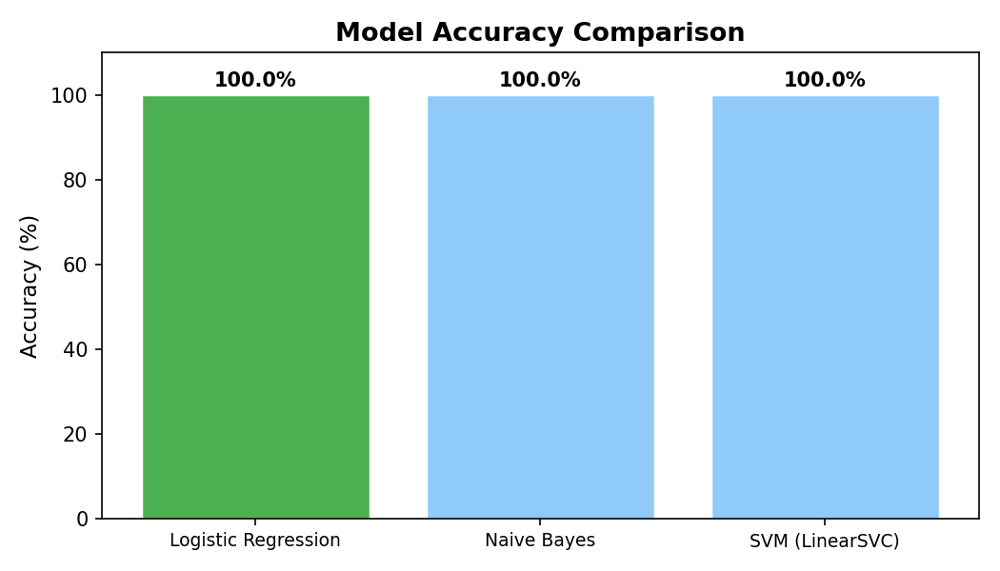
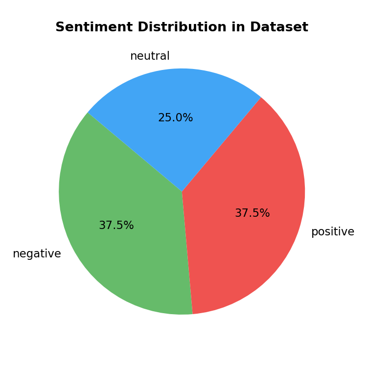
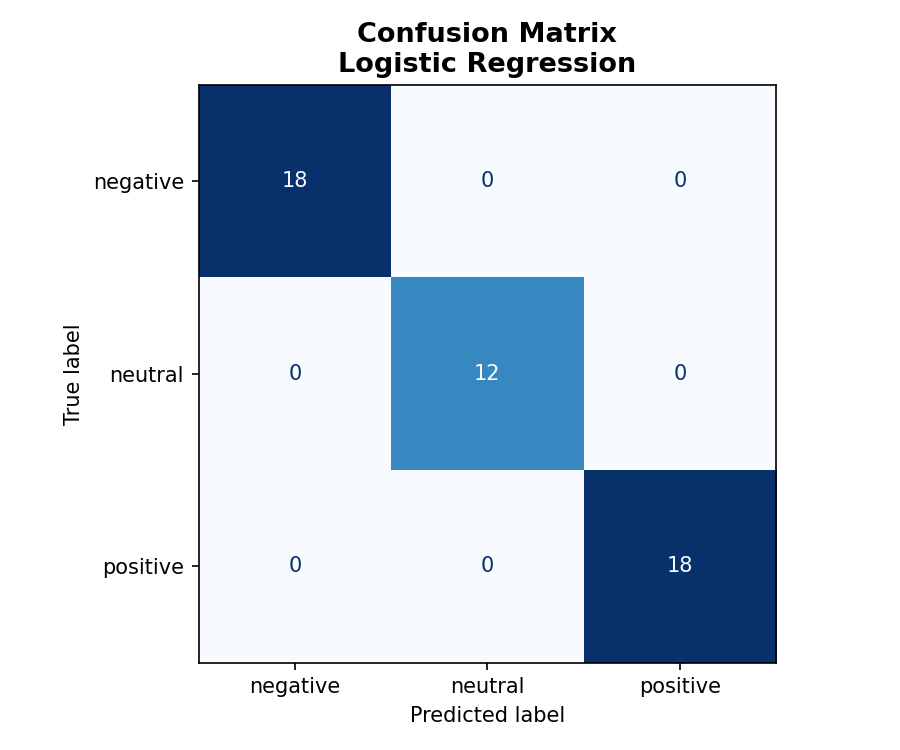

# 🔍 Customer Sentiment Analysis using Product Reviews

**Academic Semester Project | Electronics & Communication Engineering (Year 3)**
**Subject: Machine Learning | Python + Scikit-learn**

---

## 📌 Project Overview

This project analyzes customer product reviews and classifies them as:
- 😊 **Positive**
- 😞 **Negative**
- 😐 **Neutral**

It uses classical Machine Learning algorithms trained on text features extracted via **TF-IDF Vectorization**.

---

## 📁 Project Structure

```
sentiment_analysis/
│
├── train_model.py          # Trains all models, saves best one, generates plots
├── app.py                  # Command-line interactive predictor
├── streamlit_app.py        # Optional: Streamlit web interface
├── requirements.txt        # All required Python packages
│
├── utils/
│   ├── __init__.py
│   └── preprocess.py       # Text cleaning + dataset loading
│
├── models/                 # Auto-created after training
│   ├── best_model.pkl
│   ├── tfidf_vectorizer.pkl
│   └── model_name.txt
│
├── plots/                  # Auto-created after training
│   ├── confusion_matrix.png
│   ├── model_comparison.png
│   └── sentiment_distribution.png
│
└── data/                   # Place downloaded datasets here
```


## ⚙️ Setup Instructions

### 1. Clone / Download the project
```bash
cd sentiment_analysis
```

### 2. Create a virtual environment (recommended)
```bash
python -m venv venv
# Windows:
venv\Scripts\activate
# Mac/Linux:
source venv/bin/activate
```

### 3. Install dependencies
```bash
pip install -r requirements.txt
```

---

## 🚀 How to Run

### Step 1 — Train the model
```bash
python train_model.py
```
This will:
- Load the dataset
- Clean and preprocess the text
- Extract TF-IDF features
- Train 3 models (Logistic Regression, Naive Bayes, SVM)
- Print accuracy and evaluation metrics
- Save the best model to `models/`
- Save evaluation plots to `plots/`

### Step 2 — Option A: Run CLI App
```bash
python app.py
```

### Step 2 — Option B: Run Streamlit Web App
```bash
streamlit run streamlit_app.py
```
Open your browser at: http://localhost:8501

---

## 📊 Dataset Used

**Default (no download needed):** Synthetic product reviews included in `utils/preprocess.py`

**Recommended (for submission):** Amazon Product Reviews:
- URL: [Amazon Reviews](https://github.com/Kunal-Kumar-Das191049/Sentimental-Analysis-of-Amazon-Reviews/blob/master/Code%20and%20Datasets/amazon.csv)

---

## 🤖 Models Used

| Model | Description |
|-------|-------------|
| Logistic Regression | Simple linear classifier, great baseline |
| Multinomial Naive Bayes | Probabilistic model, fast for text |
| LinearSVC | SVM variant, often best for text classification |

---

## 📈 Evaluation Metrics

- **Accuracy** — overall correct predictions
- **Precision** — of predicted positives, how many are correct
- **Recall** — of actual positives, how many we caught
- **F1-Score** — harmonic mean of precision and recall
- **Confusion Matrix** — visual breakdown of predictions

---

## 📊 Results & Visualizations

### Model Comparison


### Sentiment Distribution


### Confusion Matrix



---

## 🛠️ Tech Stack

- Python 3.8+
- Pandas, NumPy
- Scikit-learn
- Matplotlib, Seaborn
- Streamlit (optional UI)

---

## 📖 Viva Tips

1. Know the difference between **TF** and **IDF**
2. Explain why you chose **TF-IDF over CountVectorizer**
3. Be able to explain what a **confusion matrix** shows
4. Mention possible improvements: LSTM, BERT, more data
5. Explain the train/test split and why it prevents overfitting

---

*Built for academic purposes. Feel free to extend it!*
